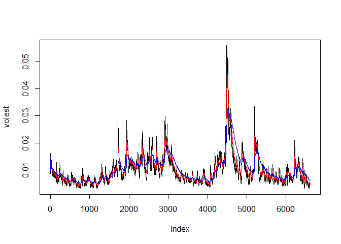

# SP500
Scott Gozdzialski  

This is a study in time series data.  I will be retrieving data from the SP500 and plotting it into different time series data styles.

#Environment set-up

This program uses the tseries R library, which needs to be installed and loaded.

```r
needed_packages = c('tseries')
for (needed_package in needed_packages) {
  if(needed_package %in% rownames(installed.packages()) == FALSE) {
    install.packages(needed_package, repos = structure(c(CRAN = "http://cran.r-project.org")))
  }
}

library(tseries)
```

```
## Warning: package 'tseries' was built under R version 3.3.3
```

#Data retrieval

I then download the S&P 500 data into a variable called SNPdata.

```r
SNPdata <- get.hist.quote("^gspc",quote="Close")
```
#Transformation

I then transform the data, I take the log of the old data and subtract from the log of the new data, giving information about the change and change amount. 

We use log because the return and loss are equal unlike percentage.

```r
SNPret <- log(SNPdata)-log(lag(SNPdata))
```

We then calculate the volatility factor of the SP 500 for all the data gathered as a whole.

```r
SNPvol <- sd(SNPret)*sqrt(250)*100
```

We build a function that changes the weights of the previous data information based upon the information we input into the function.  This allows to change the wieght of the different days from a equal wieght to all day, to downgrading older days as we see fit.

```r
getVol <- function(d, logrets) {
	var = 0
	lam = 0
	varlist <- c()

	for (r in logrets) {
		lam = lam*(1 - 1/d) + 1
	  var = (1 - 1/lam)*var + (1/lam)*r^2
		varlist <- c(varlist, var)
	}

	sqrt(varlist)
}
```

I then calculate volatility over entire length of series for various three different decay factors: 10 30 100.


```r
volest <- getVol(10,SNPret)
volest2 <- getVol(30,SNPret)
volest3 <- getVol(100,SNPret)
```
#Plot

I finally plot the results, overlaying the volatility curves on the data.  The SP data with a volatility dacay of 10 is black, with a volatility dacay of 30 is red, and with a volatility decay of 100 is blue.


```r
plot(volest,type="l")
lines(volest2, col="red", type="l")
lines(volest3, col="blue", type="l")
```

<!-- -->

